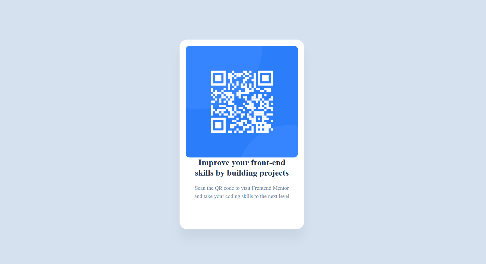

# Frontend Mentor - QR code component solution

This is a solution to the [QR code component challenge on Frontend Mentor](https://www.frontendmentor.io/challenges/qr-code-component-iux_sIO_H). Frontend Mentor challenges help you improve your coding skills by building realistic projects. 

## Table of contents

- [Overview](#overview)
  - [Screenshot](#screenshot)
  - [Links](#links)
- [My process](#my-process)
  - [Built with](#built-with)
  - [What I learned](#what-i-learned)
- [Author](#author)
- [Acknowledgments](#acknowledgments)

## Overview

### Screenshot

### Links

- Solution URL: [preview the solution here](https://qrcode-component-orcin.vercel.app/)

## My process

### Built with

- Semantic HTML5 markup
- CSS custom properties
- Flexbox

### What I learned

During this project, I acquired valuable knowledge and skills in the following areas:

1. **Creating Effective README Files**: I learned how to structure and write comprehensive README files that clearly communicate project details, usage instructions, and acknowledgments. This includes using Markdown syntax to format text, include images, and create links.

2. **Utilizing Figma Designs**: I gained experience in interpreting and implementing design specifications from Figma. This involved translating design elements into code, ensuring accurate visual representation, and maintaining design consistency throughout the project.

3. **Project Documentation**: I enhanced my ability to document project progress, features, and challenges. This included maintaining clear and organized documentation that can be easily understood by collaborators and future developers.

4. **Collaboration Tools**: By working with tools such as Git and GitHub, I improved my collaboration skills, including version control, branching, and merging changes.

5. **Attention to Detail**: Paying close attention to design details and ensuring that the final implementation matches the design specifications has strengthened my eye for design and user experience.

These learnings have not only improved my front-end development skills but also enhanced my ability to communicate and collaborate effectively on projects.

Use this section to recap over some of your major learnings while working through this project. Writing these out and providing code samples of areas you want to highlight is a great way to reinforce your own knowledge.

## Author
- Frontend Mentor - [@nik-p12](https://www.frontendmentor.io/profile/yourusername)

## Acknowledgment
- [MDN Web Docs](https://developer.mozilla.org/) for comprehensive documentation and examples on HTML and CSS.
- [CSS-Tricks](https://css-tricks.com/) for their in-depth guides on Flexbox and responsive design techniques.
- [Responsive-design](//https://www.w3schools.com/html/html_responsive.asp) for documentation and example on responsive web design
- [Flex-box](https://flexboxfroggy.com/#fr) for providing basis knowledge on flex-box by a learning by doing method.
